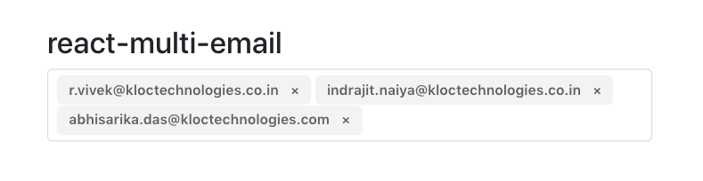

# React Multi Email :e-mail:

React Multi Email Input Field - TypeScript Enabled



## Packages Required :white_check_mark:

:one: react-multi-email: A simple react component to format multiple email as the user types.

```javascript
npm install react-multi-email -S
```
	
## Create React App With TypeScript :snowflake:

To start a new Create React App project with TypeScript, you can run:

```javascript
npx create-react-app your-app-name --typescript
```

To add TypeScript to a Create React App project, first install it:

```javascript
npm install --save typescript @types/node @types/react @types/react-dom @types/jest
```

Next, rename any file to be a TypeScript file (e.g. src/index.js to src/index.tsx) and restart your development server!

## react-app-env.d.ts

src/react-app-env.d.ts

```typescript
/// <reference types="react-scripts" />
```

## tsconfig.json

/tsconfig.json

```javascript
{
	"compilerOptions": {
		"target": "es5",
		"lib": [
			"dom",
			"dom.iterable",
			"esnext"
		],
		"allowJs": true,
		"skipLibCheck": true,
		"esModuleInterop": true,
		"allowSyntheticDefaultImports": true,
		"strict": true,
		"forceConsistentCasingInFileNames": true,
		"module": "esnext",
		"moduleResolution": "node",
		"resolveJsonModule": true,
		"isolatedModules": true,
		"noEmit": true,
		"jsx": "preserve"
	},
	"include": [
		"src"
	]
}
```

## Implementation

src/App.js :

```javascript
import React from 'react';
import Basic from './components/Basic.tsx';
import './App.css';

function App() {
	return (
		<div className="App">
			<Basic />
		</div>
	)
}

export default App;
```

src/components/Basic.tsx :

```javascript
import * as React from 'react';
import { ReactMultiEmail, isEmail } from 'react-multi-email';
import 'react-multi-email/style.css';

interface IProps { }
interface IState { emails: string[] }

class Basic extends React.Component<IProps, IState> {
	state = { emails: [] };

	render() {
		const { emails } = this.state;

		return (
			<>
				<h3>Email(s)</h3>
				<ReactMultiEmail
					placeholder=""
					emails={emails}
					onChange={(_emails: string[]) => {
						this.setState({ emails: _emails });
					}}
					validateEmail={email => {
						return isEmail(email);
					}}
					getLabel={(
						email: string,
						index: number,
						removeEmail: (index: number) => void,
					) => {
						return (
							<div data-tag key={index}>
								{email}
								<span
									data-tag-handle
									onClick={() => removeEmail(index)}
								>
									×
								</span>
							</div>
						);
					}}
				/>
			</>
		);
	}
}

export default Basic;
```

## References :book:

[How to add typescript in react applications?](https://facebook.github.io/create-react-app/docs/adding-typescript)

[Explore the react component that provides us the multi email input field!](https://www.npmjs.com/package/react-multi-email)

[Alternative way to deal with typescript in react applications!](https://www.npmjs.com/package/react-scripts-ts)

##### Vivek Ravindra :neckbeard: :bowtie: :octocat: :copyright: :registered: :tm:
